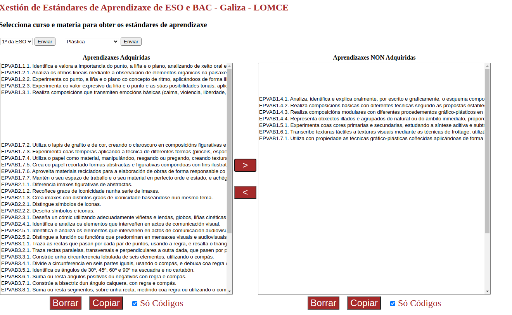

# Xestión de Estándares de Aprendizaxe ESO - BAC

Esta utilidade permite xestionar os estándares de aprendizaxe publicados no _Currículo Oficial_ de ESO e BAC da __Xunta de Galicia__

Foi desenvolvida para axilizar os traballos que a _Administración_ demandaba ao persoal docente durante o curso académico 2019/20.

Os estándares foron extraídos da seguinte documentación:

- [Currículo Educación Secundaria](https://www.edu.xunta.gal/portal/guiadalomce/secundaria)

- [Currículo Bacharelato](https://www.edu.xunta.gal/portal/guiadalomce/bacharelato)

Foron recollidos no ficheiro JSON denominado `estandares.json` para o seu tratamento con `javascript`. Podes descargar este ficheiro [aquí](https://github.com/mvilarinho/estandares/blob/master/estandares.json)

A páxina utiliza as librerias `p5.js` e `underscore.js` para o manexo de datos. Os scripts propios da páxina quedan recollidos no ficheiro `sketch.js` que podes descargar [aquí](https://github.com/mvilarinho/estandares/blob/master/estandares.json)

Accede a unha versión en funcionamento da [páxina](https://mvilarinho.github.io/estandares)

